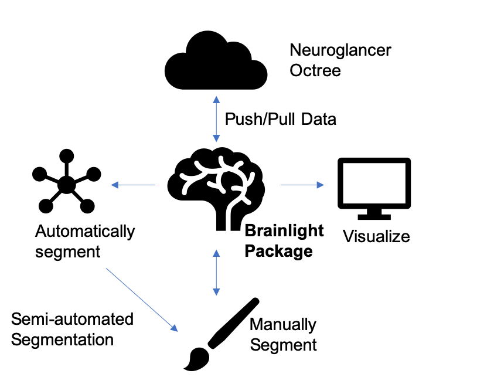

..  -*- coding: utf-8 -*-

.. _contents:

Overview of Brainlit 
====================

Brainlit is a Python package for reading and analyzing brain data.
The brain data is assumed to consist of image files in an octree structure to handle mutliple resolutions.
Optionally, the package is able to handle skeletonized axon data stored in a `.swc` file format.

Brainlit is able to handle this data, visualizing and running analysis with morphological and statistical methods.
A diagram demonstrating the capabilities of the package is shown.

Documentation
=============

.. toctree::
    :maxdepth: 1

    tutorial
    reference/index
    license

.. toctree::
    :maxdepth: 1
    :caption: Useful Links

    Brainlit @ GitHub <http://www.github.com/neurodata/brainlit/>
    Issue Tracker <https://github.com/neurodata/brainlit/issues>

Indices and tables
==================

* :ref:`genindex`
* :ref:`search`
